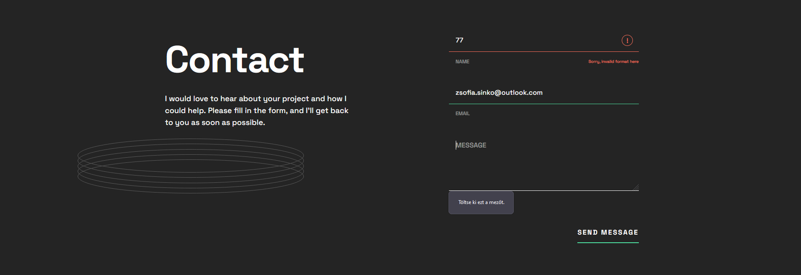

# Single Page Developer Portfolio

## Overview

This is a solution to the Single-page developer portfolio challenge on Frontend Mentor (https://www.frontendmentor.io/challenges/singlepage-developer-portfolio-bBVj2ZPi-x).

User should receive an error message when the form is submitted if:
 - Any field is empty
 - The email address is not formatted correctly
 - Name contains numbers or special characters
 - Message is longer than 200 chars

## Built with
 - Semantic HTML5 markup
 - CSS custom properties
 - CSS grid
 - CSS flex
 - Javascript
 - JQuery
 
## Work in progress:
 - View the optimal layout for the interface depending on their device's screen size
 - When the user clicks the "Contact me" call-to-action in the hero or projects section, the browser should scroll down to the contact form

## Screenshots

